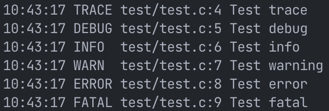
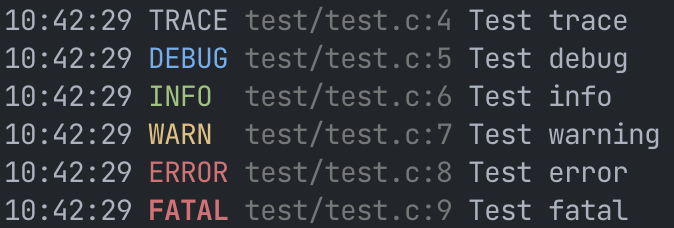

# vQbe logger
A simple header only library implemented in C99

## Functionality

- [x] Thread-safe
- [x] Console output
- [ ] File output
- [x] UNIX support
- [ ] Windows support

## Examples
### Default


### Colors enabled


## Usage
You should select exactly one C/C++ source file that instantiates the code, preferably a file you're not editing frequently. This file should define a specific macro to actually enable the function definitions.

```c
#define VQ_LOGGER_IMPLEMENTATION
#include "log.h"
```

Other files should simply include the header
```c
#include "log.h"
```

## How to enable colors?
If the library is compiled with ``-DVQ_LOGGER_USE_COLOR`` ANSI color escape codes will be used when printing.
